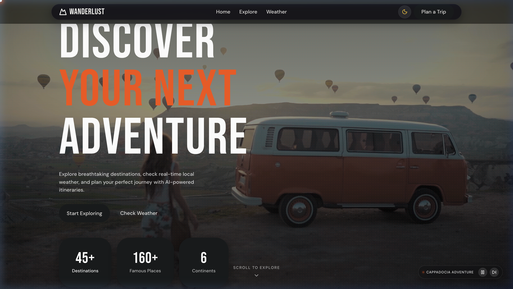
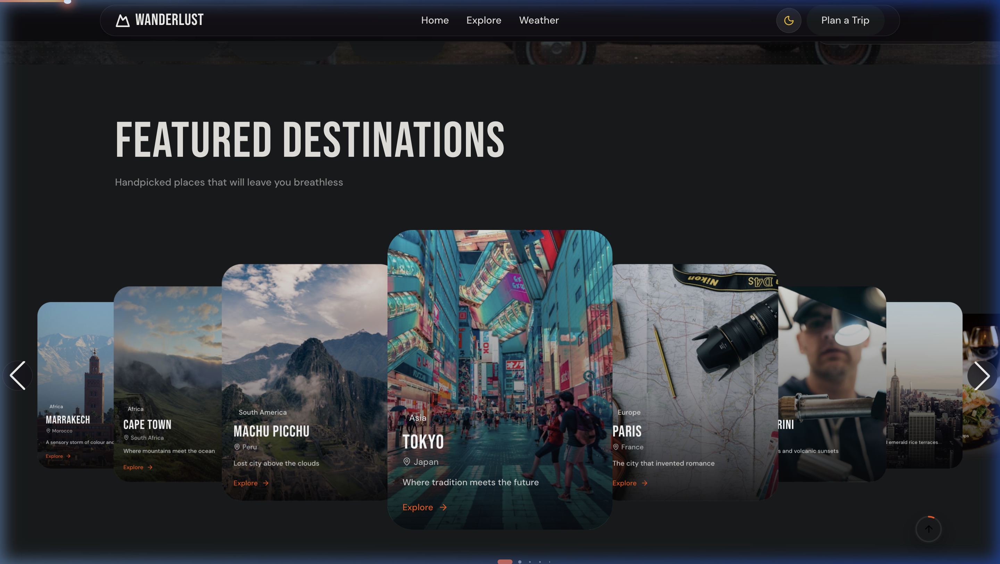
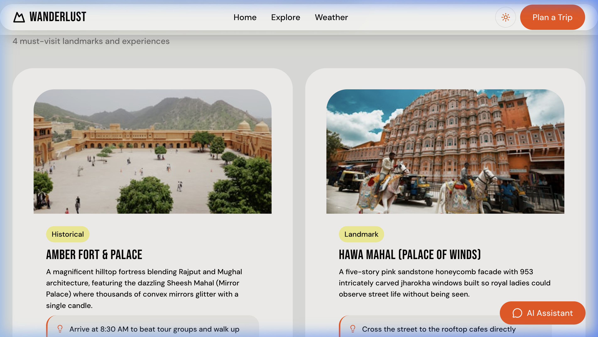
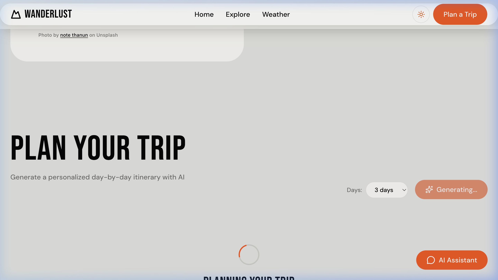
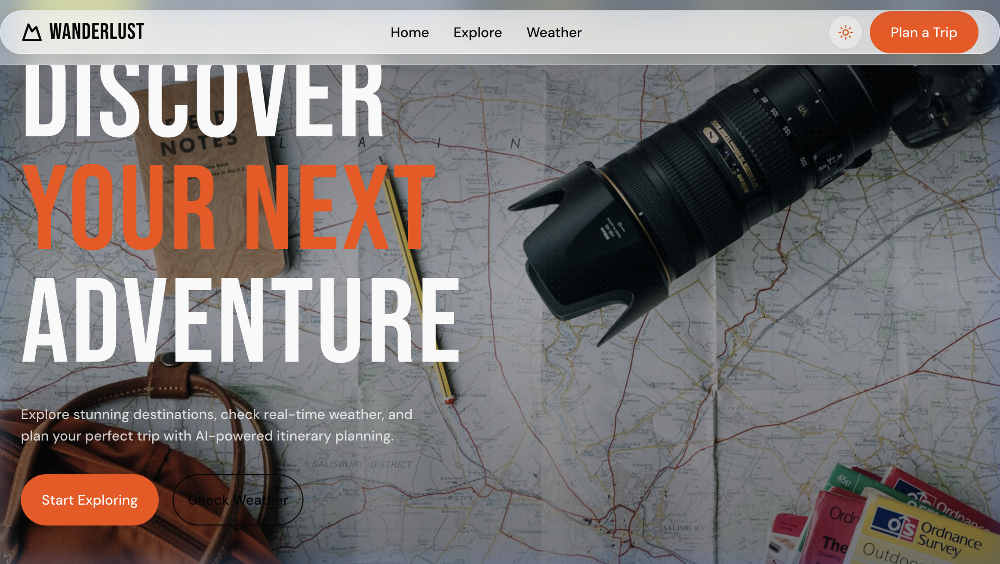

# 🌍 Wanderlust — Next-Gen AI Travel Explorer

A design-led, full-featured travel web application built with **React**, **Vite**, **GSAP**, and **Google Gemini AI**. Wanderlust lets travelers explore world destinations, check real-time local weather, discover famous landmarks with authentic photography, and generate comprehensive day-by-day itineraries with an AI assistant.

---

## 📸 Screenshots Showcase

| **Hero Landing with Live Video Background** | **3D Coverflow Featured Carousel** |
|:---:|:---:|
|  |  |

| **Landmark Cards & Travel Tips** | **AI Day-by-Day Itinerary Planner** |
|:---:|:---:|
|  |  |

| **Seamless Dark / Light Mode Transition** |
|:---:|
|  |

---

## ✨ Features & Assignment Checklist

### 01 · Landing Experience
- **Looping HD Video Background**: Streaming real-time HD travel cinematography (*Cappadocia hot air balloons & camper van*, *Alpine mountain fjords*, *Ocean cliffs*).
- **Interactive Video Controller**: Glassmorphic floating control pill with scene status, play/pause toggle, and scene switcher.
- **Cinematic Entrance Choreography**: Orchestrated with **GSAP Timeline** and subtle depth parallax on scroll.

### 02 · Destination Explorer
- **Curated 42+ Destination Catalog**: Covering top regions in Asia (including Jaipur, Agra, Varanasi, Kerala, Goa), Europe, the Americas, Africa, and Oceania.
- **Multi-Factor Filtering**: Filter by continent (*Asia, Europe, Africa, North America, South America, Oceania*) and travel style (*Beach, Culture, Adventure, Nature, Urban, Historical, Food*).
- **Dedicated Destination Pages (`/destination/:id`)**: Comprehensive guides featuring overviews, best time to visit, languages, currencies, coordinates, live weather, landmarks, and trip planners.
- **Wikivoyage MediaWiki Travel Integration**: Real-time autocomplete search bar fetching hundreds of thousands of cities worldwide on demand.

### 03 · Famous Places (Not a Bare List)
- **Rich Experience Cards**: Landmark photography, place type badge (*Temple, Landmark, Museum, Nature, Beach, Historical*), narrative description, and insider tip with lightbulb callouts.
- **Photographer Attribution**: Unsplash photographer attribution and links.

### 04 · Location Awareness
- **Browser Geolocation**: Asks visitor for location permission with one-click detection.
- **Manual City Search**: Dedicated location picker allowing users to search any city worldwide if permission is denied or preferred.
- **Zero-Failure Fallbacks**: Gracefully defaults to curated city coordinates if location is withheld.

### 05 · Real-Time Weather
- **OpenWeatherMap Integration**: Live weather conditions, temperature in Celsius, weather icon, high/low, "feels like", humidity %, wind speed (km/h), atmospheric pressure, and UV index.
- **5-Day Forecast**: Visual cards for upcoming days with temperature ranges.

### 06 · Dynamic Image Loading
- **Unsplash API Integration**: Real-time photo searches for destinations and landmark places.
- **Zero Broken Images Guarantee**: Smart multi-tier fallback system with verified category photography and automatic `onError` image recovery.

### 07 · AI Conversational Assistant
- **Google Gemini AI Assistant**: Floating interactive chatbot available on any destination page.
- **Context-Aware Prompts**: Quick-start prompts (*"How long should I spend here?"*, *"Best time of year to visit?"*, *"Top 3 hidden gems?"*).
- **Rich Markdown Formatting**: Real-time conversational streaming with error boundaries.

### 08 · Day-by-Day Itinerary Planning
- **Visual Trip Generator**: Configurable trip length (1 to 7 days) on destination pages.
- **Structured Day-by-Day Cards**: Rendered as real readable morning, afternoon, and evening timelines with activities, descriptions, and budget tips — **never as a bare block of chat text**.

---

## 🎨 Design & Interaction Details

- **Design-Led Aesthetics**: Handcrafted design tokens, curated typography pairing (**Syne** headings with **Outfit** body text), vibrant Ember accent (`#eb5e28`), and frosted glassmorphism.
- **Dark & Light Mode**: Smooth theme transitions adapting colors, borders, contrast ratios, and glassmorphic navigation blur.
- **Lenis Smooth Inertial Scrolling**: Butter-smooth momentum scrolling connected to `gsap.ticker`.
- **Scroll Progress Indicator**: Glowing top gradient line tracking page reading depth.
- **Floating Back-to-Top**: SVG circular progress ring indicating exact scroll percentage with smooth return glide.
- **Swiper 3D Coverflow**: Autoplaying 3D touch carousel with pill pagination and glass controls.

---

## 🛠️ Built With

- **Frontend Core**: React 19, Vite 8, React Router v7
- **Styling**: Vanilla CSS3 with Custom Properties & Glassmorphism
- **Motion & 3D**: GSAP 3 (Timeline, ScrollTrigger), Lenis, Swiper.js
- **Icons**: Lucide React
- **APIs**:
  - OpenWeatherMap API (Current Weather & 5-Day Forecast)
  - Google Gemini API (`gemini-2.5-flash` for itineraries and conversational assistant)
  - Unsplash API (Landscape and landmark photography)
  - Wikimedia Wikivoyage API (Keyless global city discovery)
  - Pexels Video CDN (HD background travel video streaming)

---

## 🚀 Getting Started Locally

### 1. Clone the repository
```bash
git clone https://github.com/YOUR_USERNAME/wanderlust.git
cd wanderlust
```

### 2. Install dependencies
```bash
npm install
```

### 3. Set up environment variables
Create a `.env` file in the root directory (refer to `.env.example`):
```env
VITE_OPENWEATHER_API_KEY=your_openweather_api_key
VITE_UNSPLASH_ACCESS_KEY=your_unsplash_access_key
VITE_UNSPLASH_SECRET_KEY=your_unsplash_secret_key
VITE_GEMINI_API_KEY=your_gemini_api_key
```

### 4. Start development server
```bash
npm run dev
```
Open `http://localhost:5173` in your browser.

### 5. Build for production
```bash
npm run build
npm run preview
```

---

## 🛡️ Error Handling & Edge Cases

| Scenario | Handled State |
|:---|:---|
| **Location Permission Denied** | Displays gentle informational notice; allows instant manual city search; defaults smoothly to Tokyo. |
| **OpenWeather Rate Limit / Offline** | Shows retry button with cached data indicator; app remains fully functional. |
| **Zero Destination Filter Results** | Displays an AI Discover prompt allowing users to generate a guide for any searched city on Earth. |
| **Unsplash API Quota / Missing Photo** | Automatically falls back to verified category travel photography (`200 OK`) with native `onError` safety. |
| **Gemini AI API Interruption** | Displays a structured backup itinerary so users never see an empty screen. |

---

## 📄 License
MIT License. Built for the Front-End Developer Assignment.
